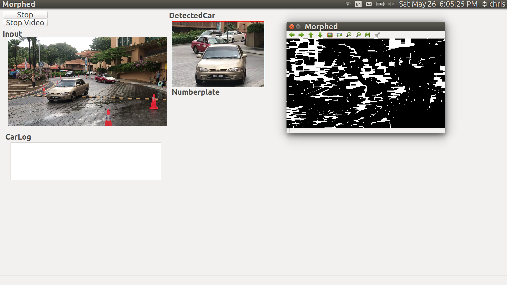

# Vehicle Counting + Number Plate Reader using OpenCv

### Modules used
- OpenCV
- tesseracact OCR
- QT for UI

### Individual Scripts

- **main.py**
This is the script to see everything running without UI 

- **carDetect.py**
This script contains the class for detecting the car using HaarCascade

- **readnumberplat.py**
This script contains the functions to convert the image into text using Tesseract 

- **start_UI.py**
This script starts the QT based UI
 
## Instructions 

***With UI***

	python start_UI.py  -v XXX
	

	
	
***Without UI***
	
	python main.py  -v  XXX
	
**what are the parameters**

for webcam
	
	-v 0
	
for video(example)

	-v IMG_6.MOV
	

**Screenshot**

 